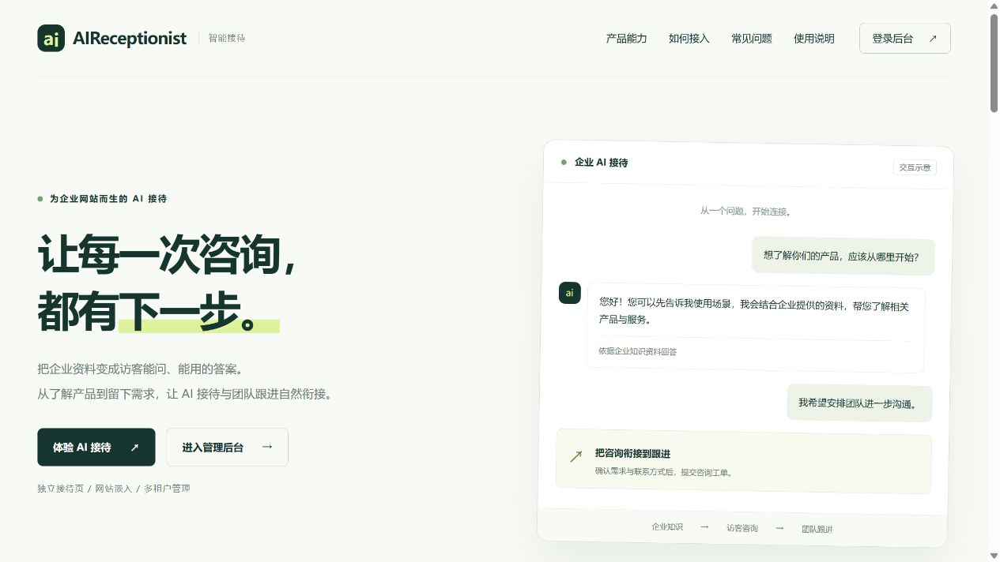

# 01 产品介绍

[说明书目录](README.md) · [下一章：快速入门](02-快速入门.md)

## 产品定位

AI接待员把企业提供的产品介绍、服务政策和常见问答用于在线咨询。访客可以直接打开接待链接，也可以在企业网站点击悬浮接待按钮。需要进一步沟通时，助手收集需求并展示工单确认卡片，访客批准后提交给团队处理。

*图 1：本地产品首页。右侧对话是首页自带的“交互示意”，并非真实客户会话或验收结果。*

## 常见使用场景

| 场景 | 访客需求 | 企业如何准备 |
| --- | --- | --- |
| 产品咨询 | 了解功能、适用条件、套餐与使用方式 | 提供清晰的产品名称、型号、套餐、价格和有效条件 |
| 服务接待 | 查询流程、售后政策、办理条件 | 提供流程、政策、服务范围与人工服务安排 |
| 合作意向 | 希望销售或业务人员进一步联系 | 配置合适的工单分类及联系方式要求 |

## 业务流程

1. 企业注册并建立接待空间、默认站点。
2. 上传企业知识，等待索引就绪。
3. 配置站点展示和允许来源，分享链接或嵌入网站。
4. 访客询问问题，助手检索当前空间的知识资料。
5. 需要人工跟进时，访客确认工单信息并批准提交。
6. 团队在后台查看工单、分配处理人、更新状态和备注。

## 主要能力

| 能力 | 提供的功能 |
| --- | --- |
| 企业知识 | 上传文件、资料说明、版本记录、下载、索引状态、失败重试、删除与恢复 |
| 访客接待 | 独立接待页、网站嵌入、历史记录、恢复咨询、手动结束和空闲自动结束 |
| 工单跟进 | 分类与扩展字段、访客确认、处理人分配、状态流转、处理历史和删除 |
| 运营管理 | 会话查看与 JSON 导出、操作审计、企业和空间用量、套餐申请 |
| 团队与隔离 | 多租户、空间选择、四级角色、站点来源限制、成员登录撤销 |
| 来源信息 | 基础来源记录；配置齐备时可解析推广来源，失败时降级 |

## 企业、空间和站点

| 名称 | 含义 | 使用注意 |
| --- | --- | --- |
| 企业／租户 | 企业账号和套餐归属 | 同一企业所有空间共用企业月额度和工单容量 |
| 接待空间 | 一组知识、站点、会话和工单的管理范围 | 先确认后台顶部选中的空间，再操作资料或站点 |
| 站点 | 一个公开接待入口 | 各站点可设置展示内容、允许来源和工单开关 |
| 工单分类 | 当前空间允许收集的需求类型 | 分类需要启用，且需求符合规则，才能提交 |

企业名称与访客看到的“企业展示名”分别设置。修改企业名称后，仍应检查各站点的展示名。

## 使用边界

- 回答质量取决于资料内容、索引状态和模型处理；应核对关键价格、政策和服务条件，资料不足时补充资料或交给人工确认。
- 工单用于后续跟进，后台会话详情用于查看；当前界面没有人工接管后直接在原会话发言的功能。
- “服务时间说明”是展示文本，不会自动限制 AI 接待时段，也不代表团队会即时回复。
- 产品没有在当前使用流程中提供自动在线支付、邮件邀请成员或企业自助编辑助手提示词的入口。
- 首次可使用免费版；付费升级通过申请、联系财务、平台确认收款和额度同步完成。

[说明书目录](README.md) · [下一章：快速入门](02-快速入门.md)
