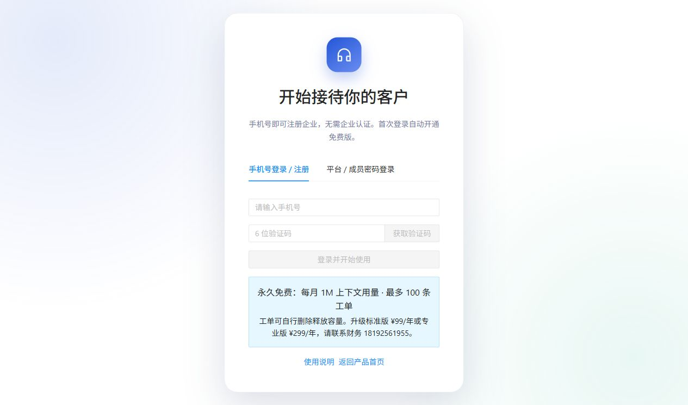

# 02 快速入门

[说明书目录](README.md) · [上一章：产品介绍](01-产品介绍.md) · [下一章：知识资料](03-知识资料.md)

## 访问入口

部署使用项目配置的产品域名时，入口如下；私有部署请替换成实际服务地址。本文未以这些链接的可访问性证明线上部署已完成。

| 入口 | 地址或路径 | 用途 |
| --- | --- | --- |
| 产品首页 | [产品首页](https://aireceptionist.bosheng.online/) | 了解产品，进入后台或演示入口 |
| 管理后台 | [管理后台](https://aireceptionist.bosheng.online/admin) | 企业注册、登录和运营管理 |
| 使用说明 | [使用说明](https://aireceptionist.bosheng.online/help) | 无需登录，支持章节浏览和关键词搜索 |
| 本企业接待页 | `/c/自己的站点标识` | 在“安装接入”取得本企业链接 |

首页的演示站点不属于新注册企业。请使用后台“安装接入”显示的链接验证本企业资料。

## 第一步：手机号注册或登录

*图 2：实际产品登录页，当前选中“手机号登录 / 注册”；未填写或提交真实手机号。*

1. 打开管理后台，选择“手机号登录 / 注册”。
2. 输入企业自用的手机号，点击“获取验证码”。
3. 填写收到的 6 位验证码，点击“登录并开始使用”。
4. 首次登录自动注册企业、建立企业管理员账号、默认空间和站点，使用免费版，无需企业认证。

验证码有效期为 5 分钟，两次发送间隔为 60 秒；验证码最多允许 5 次错误。当前实现还限制单手机号每日最多 10 次、同 IP 每小时最多 20 次发送。达到限制后按页面提示等待。

若显示“接待空间正在开通”，账号已经注册。可以等待后刷新，或由管理员在“企业与套餐”点击“重试开通”。空间开通完成后再测试接待。

## 第二步：完成企业和空间检查

1. 在“企业与套餐”保存企业名称，核对当前套餐和空间开通状态。
2. 检查顶部空间选择器。首次创建的空间名称使用注册手机号；资料和站点操作应在目标空间下进行。
3. 企业名称用于后台识别，访客展示名下一步在“站点”设置。

## 第三步：上传知识并配置接待

| 顺序 | 后台位置 | 操作 | 完成标志 |
| --- | --- | --- | --- |
| 1 | 知识资料 | 上传产品、服务和常见问答，查看“索引状态” | 资料状态为“就绪” |
| 2 | 站点 | 配置展示名、欢迎语、推荐问题、允许来源 | 保存成功，来源与实际网址一致 |
| 3 | 工单分类 | 至少配置一种需要人工跟进的分类 | 分类启用，字段规则有效 |
| 4 | 站点 | 若需收集工单，开启“允许创建工单” | 工单开关已启用 |
| 5 | 安装接入 | 打开自己的独立接待页 | 页面展示本企业内容 |

上传要求见[知识资料](03-知识资料.md)；允许来源填写方法见[站点与允许来源](04-站点与允许来源.md)。

## 第四步：做一次完整测试

1. 用资料里明确包含答案的问题咨询，例如“某产品的标准版年费是多少？”。
2. 检查回答与资料的产品名称、套餐、购买周期和价格是否一致。
3. 提出资料未覆盖的问题，检查助手是否说明资料不足或追问必要条件。
4. 如需工单，使用专门的测试内容请求人工跟进，检查确认卡片，批准后到后台核对工单。
5. 拒绝另一次确认卡片，核对未创建相应工单。
6. 在“会话”检查记录；确认后分享独立链接或安装网站组件。

工单测试可能产生真实记录，请使用团队允许的测试信息。上线检查还应覆盖真实嵌入来源、手机浏览器和容量不足时的提示。

## 认识后台导航

| 位置 | 用途 |
| --- | --- |
| 企业与套餐 | 企业名称、当前套餐、申请升级、开通与同步重试 |
| 知识资料 | 管理回答依据 |
| 工单／工单分类 | 处理需求、配置收集规则 |
| 会话／审计 | 查看咨询内容和操作记录 |
| 用量与配额 | 当前空间用量、剩余额度和重置时间 |
| 站点／安装接入 | 配置公开入口并获取安装代码 |
| 成员 | 管理团队账号和角色 |

顶部“使用说明”和业务页“如何使用”可打开对应指南；[常见问题](11-常见问题与排障.md)按现象提供排查顺序。

[说明书目录](README.md) · [上一章：产品介绍](01-产品介绍.md) · [下一章：知识资料](03-知识资料.md)
