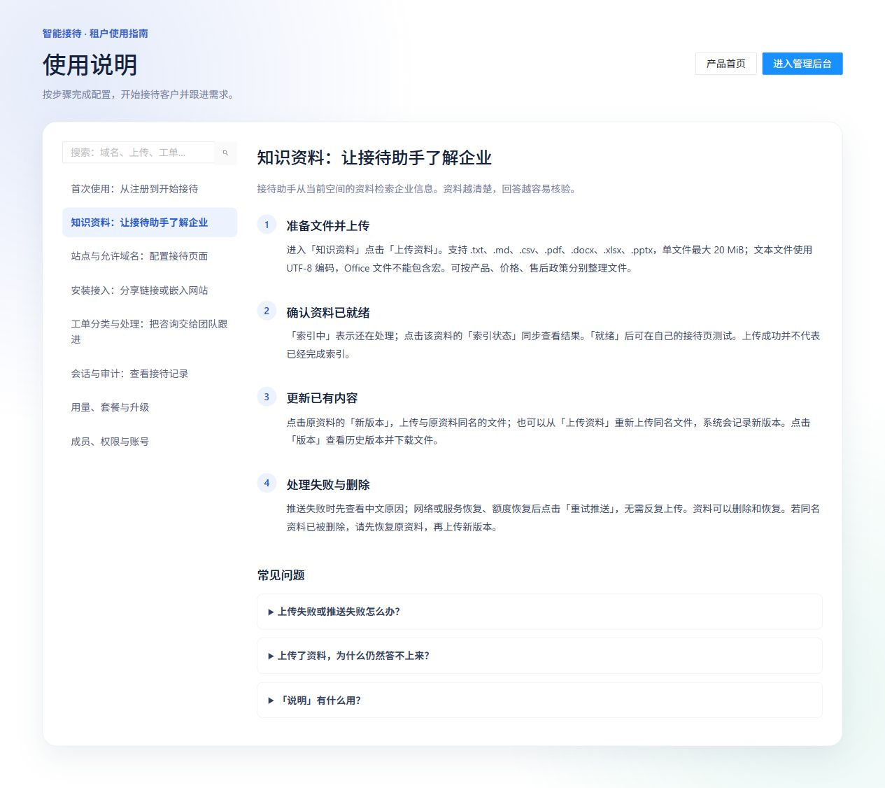

# 03 知识资料

[说明书目录](README.md) · [上一章：快速入门](02-快速入门.md) · [下一章：站点与允许来源](04-站点与允许来源.md)

企业管理员和操作员可维护知识资料，只读成员可查看。资料归属于当前接待空间，请先确认顶部选择的空间。

*图 3：产品内置“知识资料”使用指南，展示上传、索引检查、版本更新和失败恢复步骤。*

## 文件要求

| 项目 | 当前规则 |
| --- | --- |
| 支持后缀 | `.txt`、`.md`、`.csv`、`.pdf`、`.docx`、`.xlsx`、`.pptx` |
| 单文件大小 | 最大 20 MiB，即 20 × 1024 × 1024 字节 |
| 文本编码 | 文本文件使用 UTF-8 |
| Office 文件 | 使用上述格式，不包含宏，文件结构有效 |
| 校验 | 检查类型、大小、文件签名及相关内容结构 |
| 资料数量 | 受企业业务限额约束；具体以平台配置及页面提示为准 |

把产品名称、型号、套餐、计价周期、适用条件和生效时间写清楚。可分别整理产品说明、价格政策、售后政策和常见问答，减少相互矛盾的内容。当前上传流程不包含本地病毒扫描或人工审核，上传前由企业确认文件来源和可对外使用的内容。

## 上传与索引

1. 进入“知识资料”，点击“上传资料”，选择文件。
2. 系统保存资料版本，并立即提交接待服务处理。
3. 找到资料记录，点击“索引状态”查看最新处理结果。
4. 等待状态为“就绪”，再用对应站点测试问答。

**上传成功表示文件已保存或已提交，不等于已经完成索引。** 当前界面不需要执行“审核通过”再发布的步骤。

| 状态 | 含义 | 下一步 |
| --- | --- | --- |
| 推送中 | 正在提交到接待服务 | 等待并刷新 |
| 索引中 | 正在处理知识索引 | 点击“索引状态”，待就绪后测试 |
| 就绪 | 当前资料已完成索引 | 验证实际回答 |
| 推送失败 | 本地资料可能已保存，但提交服务失败 | 查看原因，恢复服务或额度后“重试推送” |
| 索引失败 | 已提交，但处理未成功 | 查看处理说明，核对文件，再重试或更新内容 |
| 已删除 | 资料被软删除 | 需要重新使用时“恢复” |

## 更新已有资料

1. 保留原资料文件名，修改内容。
2. 点击原资料记录的“新版本”，上传同名文件；也可从“上传资料”上传同名文件。
3. 查看新版本的索引状态，等待就绪。
4. 点击“版本”核对历史记录，必要时下载原文件。

“说明”用于标记资料主题，例如“产品售后退换货政策”，实际回答依据来自资料正文。下载历史版本不会自动把它恢复为当前知识；需要重新采用历史内容时，应按新版本上传流程提交。

## 失败、删除与恢复

- **文件直接被拒绝，列表无记录：**核对格式、大小、编码和是否含宏，修正后重新上传。
- **已有记录显示推送失败：**先解决网络、服务开通或额度问题，再点击原记录“重试推送”，避免重复上传。
- **删除资料：**是可以恢复的软删除。更新同名资料前，若原记录已删除，应先恢复原资料。
- **恢复资料：**点击“恢复”，核对最新索引状态并再次验证问答。

知识变更需要通过服务处理才会反映到问答。不能只凭本地版本记录判断新知识已经生效。

## 上传后答不上来的检查顺序

1. 上传和测试是否属于同一空间。
2. 测试是否使用后台“安装接入”中的本企业站点。
3. 当前资料版本是否“就绪”。
4. 正文是否确实包含问题所需的产品、套餐和条件。
5. 是否刚修改资料或分类，应开始新咨询测试最新配置。

[说明书目录](README.md) · [上一章：快速入门](02-快速入门.md) · [下一章：站点与允许来源](04-站点与允许来源.md)
