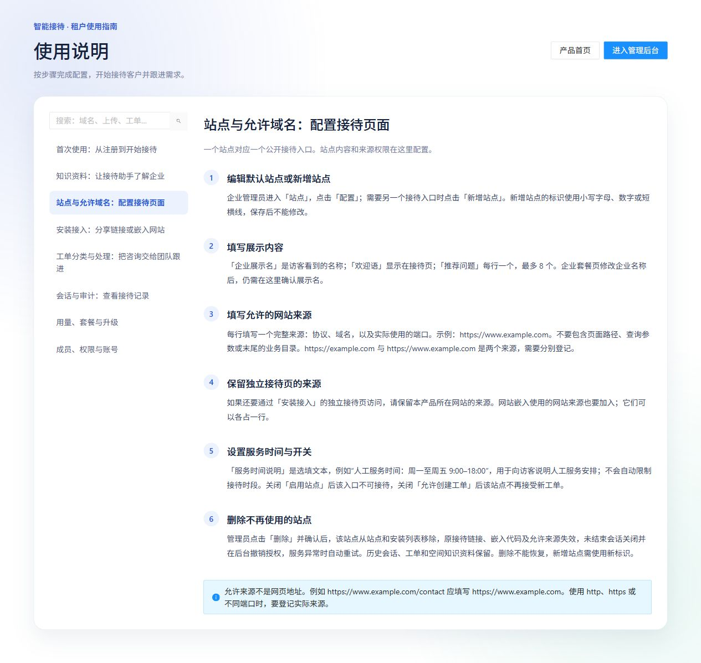

# 04 站点与允许来源

[说明书目录](README.md) · [上一章：知识资料](03-知识资料.md) · [下一章：网站安装与访客使用](05-网站安装与访客使用.md)

企业管理员或平台运营可配置站点。站点是公开接待入口；多个站点可使用同一空间的知识。



*图 4：产品内置站点指南，重点说明完整来源、独立接待页来源和站点开关。*

## 新增或编辑站点

1. 选择目标空间，进入“站点”。
2. 编辑已有记录时点击“配置”；新建入口时点击“新增站点”。
3. 填写展示内容与允许来源，核对开关后保存。
4. 到“安装接入”打开该站点测试。

| 字段 | 填写方法 |
| --- | --- |
| 公开站点标识 | 使用小写字母、数字或短横线，例如 `company-sales`；保存后不能修改 |
| 企业展示名 | 访客看到的企业或服务名称，独立于企业套餐页的名称 |
| 欢迎语 | 告诉访客可咨询什么，例如“您好，可以咨询我们的产品和售后服务” |
| 服务时间说明 | 选填，例如“人工服务时间：周一至周五 9:00–18:00”；仅为展示文本 |
| 允许的网站来源 | 每行一个完整来源，含协议、域名及实际端口 |
| 推荐问题 | 每行一个，最多 8 个，宜使用资料中有明确答案的问题 |
| 启用站点 | 开启后该站点可以接待；关闭后入口不可接待 |
| 允许创建工单 | 开启后可按有效分类创建工单；关闭后不接受新工单 |

## 正确填写允许来源

来源只包含协议、域名和端口，不包含页面路径或查询参数。不要直接把完整业务页面地址放入来源名单。

| 实际访问地址 | 应登记的来源 |
| --- | --- |
| `https://www.example.com/contact` | `https://www.example.com` |
| `https://example.com/?from=home` | `https://example.com` |
| `https://support.example.com:8443/help` | `https://support.example.com:8443` |
| `http://localhost:3000/` | `http://localhost:3000`（仅对应本地测试站点） |

`http` 与 `https`、带 `www` 与不带 `www`、不同子域名或端口，都属于不同来源，应按实际需要分别登记。

部署在项目产品域名并嵌入示例企业网站时，可填写：

```text
https://aireceptionist.bosheng.online
https://www.example.com
https://example.com
```

第一行保留独立接待页所在的产品来源，后两行替换为企业实际使用的网站来源。仅登记实际需要的来源。

## 保存后的测试

分别打开独立接待页和企业网站组件，检查展示名、欢迎语、推荐问题与问答；如需工单，再测试确认提交。保存“允许来源”后，应刷新实际使用的网站页面。

## 删除站点

管理员点击“删除”并确认后，站点从站点列表及安装列表移除，原链接、接入代码和来源权限失效，未结束会话关闭并在后台撤销授权；服务异常时后台重试。

已有会话、工单和空间知识资料保留，不会删除整个接待空间。站点删除不能恢复，原标识不能复用；若只是暂时停止服务，可先使用“启用站点”开关。

[说明书目录](README.md) · [上一章：知识资料](03-知识资料.md) · [下一章：网站安装与访客使用](05-网站安装与访客使用.md)
