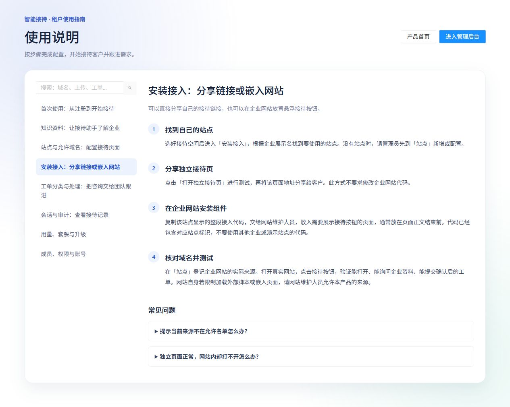

# 05 网站安装与访客使用

[说明书目录](README.md) · [上一章：站点与允许来源](04-站点与允许来源.md) · [下一章：工单分类与处理](06-工单分类与处理.md)

## 两种接入方式

| 方式 | 需要准备 | 适合用途 |
| --- | --- | --- |
| 独立接待链接 | 已配置站点和产品来源 | 分享给客户、先行测试，无需改企业网站代码 |
| 网站悬浮组件 | 已配置站点、企业网站来源及页面代码 | 在现有企业网站提供咨询入口 |



*图 5：产品内置安装指南。每个站点的实际链接和专属脚本由后台“安装接入”页面提供。*

## 分享独立接待链接

1. 在后台选好空间，进入“安装接入”。
2. 根据企业展示名找到目标站点，点击“打开独立接待页”。
3. 验证展示与知识回答后，复制该页面地址分享给客户。

链接格式为 `产品服务地址/c/站点标识`。请使用后台生成的实际地址；首页演示链接不能替代本企业入口。

## 安装网站组件

1. 在“站点”登记企业网站的完整来源，保留需要使用的独立页来源。
2. 在“安装接入”复制本站点显示的整段脚本。
3. 将代码交给网站维护人员，加入需要显示接待入口的页面，通常放在 `</body>` 前。
4. 发布网站后，在真实域名下刷新页面并测试。

以下仅展示格式，`company-sales` 必须替换为后台提供的真实站点标识，脚本域名应与实际部署一致：

```html
<script
  src="https://aireceptionist.bosheng.online/widget.js"
  data-site-key="company-sales"
></script>
```

组件在页面右下方显示“AI”按钮，打开后通过嵌入页接待。手机窄屏采用全屏面板。组件按钮“×”收起面板，不能据此判断咨询已结束；结束咨询请使用会话内的相应操作。

如果网站设置内容安全策略（CSP），网站维护人员需按既有安全方案允许加载本产品的脚本和嵌入页面。浏览器限制嵌入访问时，可使用接待页提供的新窗口入口。

## 访客使用流程

1. 打开链接或点击网站“AI”按钮，查看企业展示名、欢迎语和推荐问题。
2. 输入问题或选择推荐问题，开始咨询。
3. 需要人工跟进时，按助手提示提供所需信息，检查工单确认卡片。
4. 同意提交时批准卡片；不同意时拒绝或先修改信息。
5. 需要回看时使用历史入口；符合会话状态和授权条件时恢复咨询。
6. 已结束或空闲关闭的会话不能继续，应点击“开始新咨询”。

访客历史与当前访客身份和浏览器访问条件有关；更换浏览器或设备、清除相关数据后，不保证能恢复相同历史。

## 会话结束

默认连续 10 分钟没有访客新消息，会话由服务端自动结束并撤销授权。工单反馈消息也计为访客活动；刷新页面、保持窗口打开或授权自动续期不会延长会话。关闭浏览器后仍会计时，历史和已提交工单保留。实际部署可调整空闲时长，以提示为准。

## 安装验收清单

- 独立页和嵌入页面展示正确的企业与站点。
- 真实网站的协议、域名及端口都在允许来源中。
- 资料就绪，问答覆盖常见问题和资料不足的问题。
- 工单卡片信息正确；批准后后台有记录，拒绝后没有对应记录。
- 电脑与手机均能打开、输入和关闭面板。
- 嵌入访问受限时，新窗口接待入口可用。

[说明书目录](README.md) · [上一章：站点与允许来源](04-站点与允许来源.md) · [下一章：工单分类与处理](06-工单分类与处理.md)
