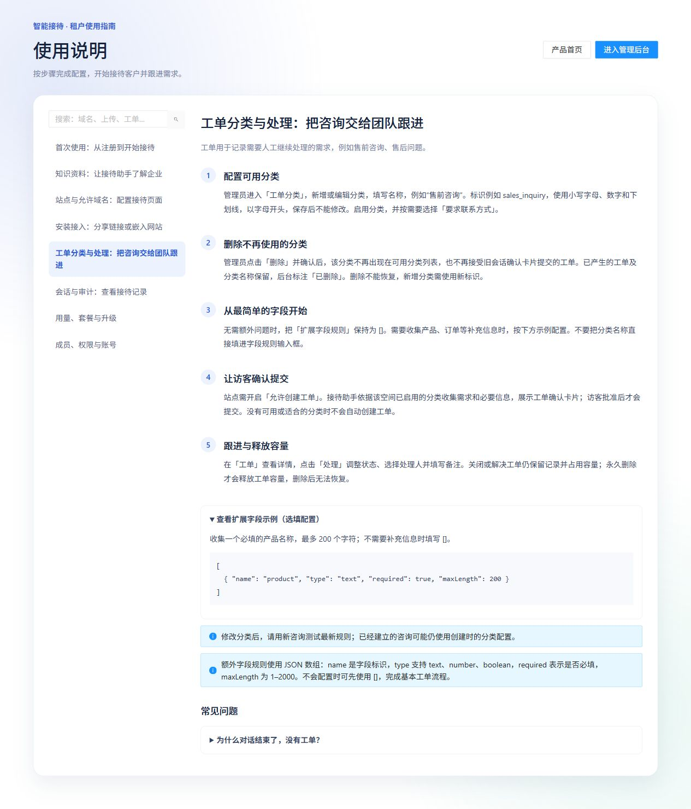

# 06 工单分类与处理

[说明书目录](README.md) · [上一章：网站安装与访客使用](05-网站安装与访客使用.md) · [下一章：会话与审计](07-会话与审计.md)

工单记录需要团队继续处理的需求。普通问答不一定产生工单；工单也不代表人工已经接手或作出服务承诺。



*图 6：产品内置工单指南，已展开扩展字段示例；这是使用说明页面，不是实际提交记录或确认卡片截图。*

## 配置工单分类

企业管理员或平台运营进入“工单分类”，点击“新增分类”或已有分类的“配置”。

| 字段 | 说明 | 示例 |
| --- | --- | --- |
| 分类标识 | 小写字母、数字、下划线，以字母开头；保存后不能修改 | `sales_inquiry` |
| 分类名称 | 访客和后台看到的名称 | 售前咨询 |
| 启用 | 是否允许使用此分类收集新工单 | 开启 |
| 要求联系方式 | 是否必须提供联系方式 | 按团队跟进需要设置 |
| 扩展字段规则 | JSON 数组，定义需收集的补充信息 | 无补充信息时填写 `[]` |

仅有分类还不够：对应站点需开启“允许创建工单”，空间和会话可用，分类与需求匹配且信息满足规则，并有足够工单容量。

## 扩展字段示例

收集一个必填的产品名称：

```json
[
  {
    "name": "product",
    "type": "text",
    "required": true,
    "maxLength": 200
  }
]
```

| 属性 | 含义 |
| --- | --- |
| `name` | 字段标识；使用固定、明确的名称 |
| `type` | 支持 `text`、`number`、`boolean` |
| `required` | 是否必填，使用 JSON 的 `true` 或 `false` |
| `maxLength` | 长度规则，允许 1–2000；示例文本上限为 200 |

不要把分类名称填入规则输入框，也不要使用中文引号或尾随逗号。不需要额外字段时，用 `[]` 完成基本流程。修改分类后使用新咨询测试；旧咨询可能保留创建时配置，但服务端仍验证提交时的分类状态。

## 访客确认后提交

1. 助手根据有效分类收集摘要、联系方式和必要补充信息。
2. 展示确认卡片供访客核对。
3. 访客批准后提交；拒绝卡片不创建对应工单。
4. 团队以后台“工单”列表中的记录判断创建是否成功。

没有可用或合适的分类、信息不符合规则、额度或容量不足，以及实际提交失败时，不能视为工单已创建。助手在文字中表示“会帮您登记”也不能替代后台记录。

## 查看、分配和处理

企业管理员和操作员可处理工单，只读成员可查看，联系方式按权限展示。进入“工单”，按状态筛选，点击“详情”查看编号、摘要、分类、联系方式、状态与处理历史；点击“处理”调整状态、选择处理人和填写备注。

处理人必须是本企业启用的非只读成员。多成员同时操作时，如果提示记录已改变，应刷新详情，核对最新状态后再保存。

| 当前状态 | 可切换状态（不含保持原状态） |
| --- | --- |
| 待处理 | 处理中、已关闭 |
| 处理中 | 待处理、已解决、已关闭 |
| 已解决 | 处理中、已关闭 |
| 已关闭 | 待处理 |

因此，待处理工单若已处理完成，应先进入“处理中”，再改为“已解决”。处理备注用于记录已联系、补充资料和下一步安排。

## 删除与容量

解决或关闭工单仍保留记录并占用工单容量。需要释放容量时，有操作权限的成员可点击“删除”，确认后清空工单正文、联系方式、补充字段和处理历史，仅保留防重复提交所需标识。删除后无法通过产品恢复。

管理员删除分类后，该分类不再接受新工单，旧确认卡片也不能继续提交该分类。历史工单和原分类名称保留，后台标注“已删除”；分类本身不能恢复，原分类标识不可复用。

[说明书目录](README.md) · [上一章：网站安装与访客使用](05-网站安装与访客使用.md) · [下一章：会话与审计](07-会话与审计.md)
