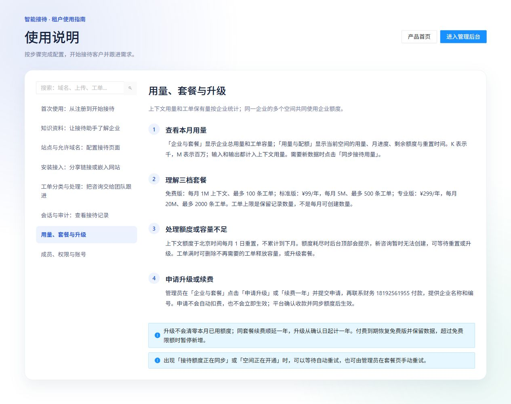

# 08 套餐与用量

[说明书目录](README.md) · [上一章：会话与审计](07-会话与审计.md) · [下一章：成员与权限](09-成员与权限.md)

## 当前套餐

以下是截至 2026-10-06 本地产品代码和指南中的套餐配置；实际办理时核对部署后台显示的价格、容量和付款联系人。

| 套餐 | 年费 | 企业每月上下文用量 | 工单保有量 |
| --- | ---: | ---: | ---: |
| 免费版 | 0 元 | 1,000,000 tokens（1M） | 100 条 |
| 标准版 | 99 元／年 | 5,000,000 tokens（5M） | 500 条 |
| 专业版 | 299 元／年 | 20,000,000 tokens（20M） | 2000 条 |

*图 7：产品内置套餐说明页，展示企业用量口径、工单容量和升级流程；不是企业付款记录。*

## 计量规则

- 同一企业所有接待空间的输入与输出 tokens 合计计入企业月用量。
- 页面中的 K 表示千，M 表示百万。tokens 是上下文用量单位，不等于消息条数、访客数或固定汉字数。
- 月额度按北京时间自然月计算，每月 1 日重置，未使用额度不结转。
- 升级不会清零当月已用额度，正在处理的运行保留创建时的额度规则，变更影响后续新运行。
- 工单上限是当前保留记录的数量，不是每月可新建的数量；解决或关闭仍占容量，永久删除后释放。

例如免费版已使用 80 万 tokens，升级到标准版后，本月已用仍为 80 万，企业月上限改为 500 万。标准版保留 500 条工单时，即使全部已关闭，也需要删除不再需要的记录或升级后才能继续增加。

## 在哪里查看

| 页面 | 显示范围 |
| --- | --- |
| 企业与套餐 | 企业总月用量、当前套餐、工单记录数、付费到期、下次重置时间和申请记录 |
| 用量与配额 | 当前空间月进度、剩余额度、重置时间、用量汇总和按日统计 |
| 后台顶部提示 | 当前企业或空间额度耗尽、预计恢复时间 |

“用量与配额”显示最后成功同步时间。具有操作权限的成员可点击“同步接待用量”；同步失败时页面可能保留上一次成功的数据，不应将它当作当前实时剩余量。

## 升级和续费

1. 企业管理员在“企业与套餐”选择“申请升级”或“续费一年”。
2. 核对套餐和金额，提交申请。
3. 按后台显示的财务联系方式付款，提供企业名称和企业编号。本地默认联系方式为 **18192561955**，以当前部署页面为准。
4. 平台确认收款，更新企业套餐及工单容量，并同步各空间接待额度。
5. 刷新套餐页，检查申请状态、到期时间和是否仍提示额度同步。

提交申请不会自动扣费，也不会立即增加额度。未付款的待处理申请可按界面取消。平台确认重复请求不会重复续期。

| 情况 | 计期和数据规则 |
| --- | --- |
| 同套餐续费 | 从现有有效到期日顺延一年 |
| 升级套餐 | 从确认日起计一年，不自动折算原套餐剩余价值 |
| 付费到期 | 按免费版限额处理，保留已有数据；超限时暂停新增 |
| 收款成功、额度同步失败 | 付款记录和本地套餐保留，自动重试；管理员也可点击“重试同步” |

## 额度或容量不足

月额度耗尽时，新会话、访问授权续期和资料推送受限，可等待重置或升级。后台会处理超额租户已有会话的授权，实际运行和同步存在延迟，当前机制不能保证逐 token 精确硬截止。

工单容量不足时，可在保留必要业务信息后删除旧工单，或升级套餐。资料数量、每日新建会话等业务限额还受平台配置约束，三档套餐表不代表所有限流条件。

“接待空间正在开通”或“接待额度正在同步”时，等待自动重试或由管理员手动重试。同步未完成期间暂停新的接待授权和资料推送，已保存的业务数据保留。

[说明书目录](README.md) · [上一章：会话与审计](07-会话与审计.md) · [下一章：成员与权限](09-成员与权限.md)
