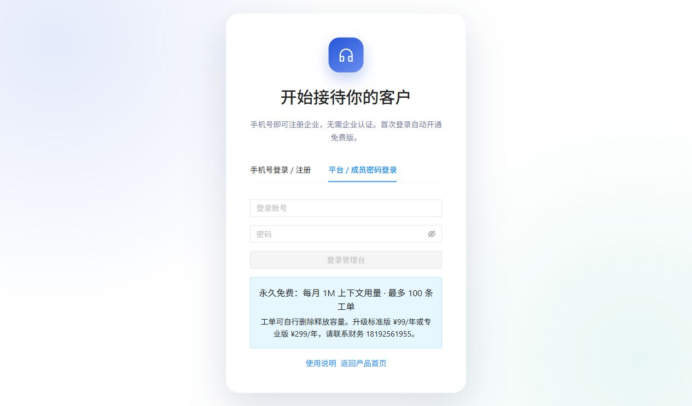

# 09 成员与权限

[说明书目录](README.md) · [上一章：套餐与用量](08-套餐与用量.md) · [下一章：平台运营](10-平台运营.md)

## 角色与权限

普通手机号首次注册获得企业管理员角色。平台运营账号由平台管理；企业管理员只能为本企业创建管理员、操作员或只读成员。

| 功能 | 平台运营 | 企业管理员 | 操作员 | 只读成员 |
| --- | --- | --- | --- | --- |
| 查看授权范围内资料、工单、会话、用量与审计 | 可以 | 可以 | 可以 | 可以 |
| 上传、更新、重试、删除与恢复知识资料 | 可以 | 可以 | 可以 | 不可以 |
| 处理、分配、删除工单 | 可以 | 可以 | 可以 | 不可以 |
| 查看工单联系方式 | 完整 | 完整 | 完整 | 按只读权限脱敏展示 |
| 导出会话、关闭／撤权、手动同步用量 | 可以 | 可以 | 可以 | 不可以 |
| 配置或删除站点、工单分类 | 可以 | 可以 | 不可以 | 不可以 |
| 管理成员、撤销他人登录 | 可以 | 本企业 | 不可以 | 不可以 |
| 修改企业名称、提交套餐申请和手动开通／同步重试 | 可以 | 可以 | 不可以 | 不可以 |
| 平台租户、空间映射和收款确认 | 可以 | 不可以 | 不可以 | 不可以 |

企业成员的数据访问受企业及空间归属约束，切换空间后应重新核对所操作的记录。

## 创建成员账号

1. 管理员进入“成员”，点击“新增成员”。
2. 设置登录账号、姓名、角色、启用状态和至少 12 个字符的初始密码。
3. 保存后把登录方式和账号交给对应团队成员。
4. 成员打开后台，在“平台 / 成员密码登录”输入账号和密码。

当前采用管理员创建账号，没有邮件邀请流程。

*图 8：登录页选中“平台 / 成员密码登录”；未填写或提交真实账号密码。*

## 密码和登录管理

- 登录成员可通过顶部“密码”设置或修改自己的密码，保存后全部登录失效，需要重新登录。
- 管理员可在其他成员的“编辑”中重置密码；重置密码字段留空表示保持原密码。
- 停用成员后，该账号不能继续正常使用。
- “撤销登录”结束该成员现有登录，账号记录仍保留。若需要持续禁止登录，应停用成员。

## 删除成员

管理员点击成员的“删除”并确认后，账号被移除、全部登录撤销；其负责工单改为未分配，应重新安排处理人。工单、处理历史和审计保留。

不能删除平台账号、当前登录账号或本企业最后一位启用的管理员。最后管理员的停用或角色修改也受保护；替换管理员时，应先新增并启用另一位企业管理员。

## 企业删除与普通成员操作的区别

企业成员不能自行删除整个企业。平台删除企业会清理成员、空间、站点、资料、会话、工单和套餐收款记录，属于不同范围的操作，详见[平台运营](10-平台运营.md)。

[说明书目录](README.md) · [上一章：套餐与用量](08-套餐与用量.md) · [下一章：平台运营](10-平台运营.md)
